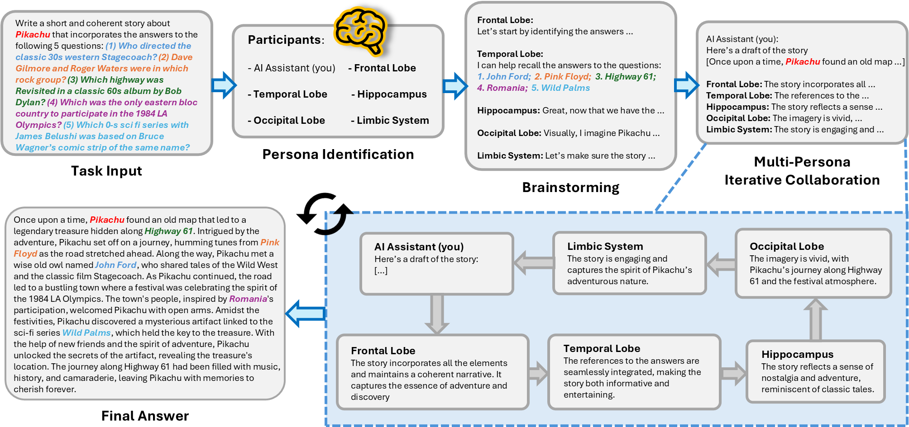

# Brain Performance Prompting (BPP)

## Abstract
Recent studies have highlighted similarities between human neural pathways and LLM operational mechanisms. While the Solo Performance Prompting (SPP) exhibits cognitive synergy akin to human collaboration in LLMs like GPT-4, it faces limitations in generalizability and defining the conditions for cognitive synergy emergence. To address these issues, we introduce **Brain Performance Prompting (BPP)**, an innovative framework inspired by human neural pathways. BPP dynamically activates task-specific brain region personas to LLMs, enhancing self-collaboration and advancing cognitive synergy beyond SPP. Moreover, BPP provides a new understanding of the emergence of cognitive synergy by observing its partial manifestation in the smaller GPT-4o-mini. Our experiments demonstrate that BPP significantly outperforms SPP and other approaches across knowledge-intensive and reasoning-intensive tasks on GPT-4o. These findings suggest that drawing inspiration from human brain information processing principles can play a crucial role in optimizing LLM performance.

## Overview
 

## Requirements
- Install dependencies
    ```
    pip install -r requirements.txt
    ```
- Write your OpenAI API key in the `config_template.sh` file, then run `source config_template.sh` command.

## Quick Start
You can run BPP for each of the three tasks using the following commands. If you want to use a different configuration for the model, method, etc., you can modify settings such as 'Model' and 'Method' in the `scripts/` folder.
- Trivia Creative Writing: `bash scripts/trivia_creative_writing.sh`
- Codenames Collaborative: `bash scripts/codenames_collaborative.sh`
- Logic Grid Puzzle: `bash scripts/logic_grid_puzzle.sh`

## Paper Experiment Results
All experimental results from the paper can be found in the `logs/` folder. The folder includes results for each task and model, and the overall results can be easily viewed in the `accuracy_results...wo_sys_mes.xlsx` file.

## How to Cite
If you use this code interesting or useful, please consider cite the paper and star this repo.
```
```

## Acknowledgements
Our code is based on [SPP](https://github.com/mikewangwzhl/solo-performance-prompting?tab=readme-ov-file), and we would like to thank the original authors.

